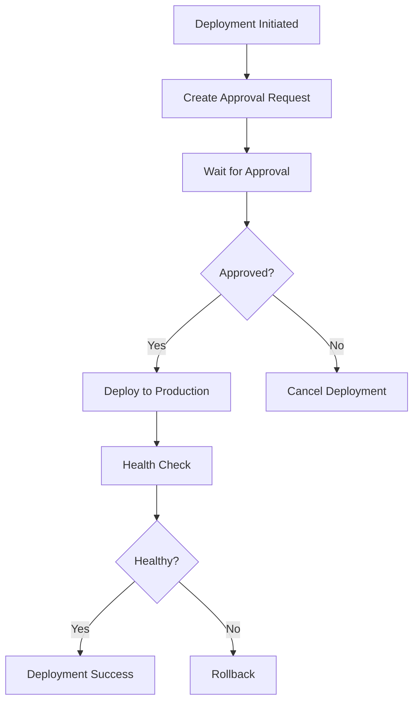

# CI/CD Deployment Guide

## Overview

This document describes the CI/CD pipeline implementation for the NY Fashion POS system, including automated testing, security scanning, multi-environment deployment, and rollback procedures.

## Pipeline Architecture

### 1. Continuous Integration (CI)

#### Security Scan Stage
- **Dependency Audit**: Checks for known vulnerabilities in npm packages
- **Snyk Scanning**: Advanced vulnerability detection and monitoring
- **Code Analysis**: Static analysis for security issues and code quality
- **Docker Security**: Container image vulnerability scanning

#### Code Quality Stage
- **ESLint**: Code linting and style enforcement
- **Tests with Coverage**: Unit and integration tests with coverage reporting
- **Coverage Threshold**: Minimum 80% coverage required
- **Quality Gates**: Automated quality checks before deployment

#### Build Stage
- **Multi-Environment Builds**: Separate builds for staging and production
- **Environment-Specific Configuration**: Different configs per environment
- **Artifact Storage**: Build artifacts stored for deployment

### 2. Continuous Deployment (CD)

#### Staging Deployment
- **Automatic Trigger**: Deploys from `develop` branch automatically
- **Health Checks**: Automated health verification after deployment
- **Environment Update**: Updates staging environment status

#### Production Deployment
- **Approval Required**: Manual approval process for production deployments
- **Environment Protection**: GitHub environment protection rules
- **Health Monitoring**: Comprehensive health checks and monitoring

### 3. Rollback System

#### Automatic Rollback Triggers
- Failed health checks
- Critical errors detected
- Manual rollback initiation

#### Rollback Process
- Identifies last successful deployment
- Downloads rollback artifacts
- Executes rollback deployment
- Verifies rollback success

## Environment Configuration

### Staging Environment
```javascript
// configs/environment.staging.js
{
  environment: 'staging',
  features: {
    debugMode: true,
    experimentalFeatures: true
  },
  security: {
    rateLimit: { max: 1000 }
  }
}
```

### Production Environment
```javascript
// configs/environment.production.js
{
  environment: 'production',
  features: {
    debugMode: false,
    experimentalFeatures: false
  },
  security: {
    rateLimit: { max: 100 },
    enableSecurityHeaders: true
  }
}
```

## Security Scanning

### Dependency Scanning
- **npm audit**: Built-in npm vulnerability scanning
- **Snyk**: Third-party security monitoring
- **Automated Updates**: Dependabot integration for security patches

### Code Analysis
- **ESLint Security Rules**: Static analysis for security issues
- **SAST**: Static Application Security Testing
- **Custom Rules**: Project-specific security rules

### Container Security
- **Trivy**: Docker image vulnerability scanning
- **Base Image Updates**: Regular base image security updates
- **Minimal Images**: Use of minimal, secure base images

## Approval Process

### Production Deployments
1. **Automatic Request**: System creates approval request
2. **Role-Based Approval**: Requires Administrator or Manager approval
3. **Approval Tracking**: All approvals logged with timestamps
4. **Timeout Handling**: 60-minute timeout for approvals

### Approval Workflow


## Monitoring and Alerting

### Health Checks
- **Application Health**: Custom health check endpoints
- **Database Connectivity**: Database connection verification
- **External Services**: Third-party service availability

### Performance Monitoring
- **Response Times**: API response time monitoring
- **Error Rates**: Error rate tracking and alerting
- **Resource Usage**: CPU, memory, and storage monitoring

### Security Monitoring
- **Vulnerability Alerts**: Real-time vulnerability notifications
- **Security Scan Results**: Regular security scan reports
- **Compliance Tracking**: Security compliance status monitoring

## Rollback Procedures

### Automatic Rollback
- Triggered by failed health checks
- Automatic identification of rollback target
- Minimal downtime rollback process

### Manual Rollback
1. Access Rollback Manager in deployment dashboard
2. Select environment and rollback target
3. Provide rollback reason and confirmation
4. Monitor rollback progress and health checks

### Rollback Verification
- Health check validation
- Functional testing
- Performance verification
- Database integrity checks

## Database Integration

### Deployment Tracking
- **deployments**: Main deployment records
- **deployment_approvals**: Approval workflow tracking
- **deployment_environments**: Environment status monitoring
- **deployment_pipeline**: Pipeline stage tracking

### Data Relationships
```sql
deployments (1) -> (*) deployment_approvals
deployments (1) -> (*) deployment_pipeline
deployment_environments (*) -> (1) deployments
```

## Usage Guide

### For Developers
1. **Feature Development**: Work on feature branches
2. **Pull Requests**: Create PRs to `develop` for staging deployment
3. **Production Deployment**: Merge `develop` to `main` for production

### For DevOps Teams
1. **Pipeline Monitoring**: Use deployment dashboard for oversight
2. **Security Review**: Monitor security scan results
3. **Environment Management**: Manage environment configurations

### For Managers
1. **Approval Process**: Review and approve production deployments
2. **Rollback Authorization**: Authorize emergency rollbacks
3. **Compliance Oversight**: Monitor security compliance status

## Troubleshooting

### Common Issues
1. **Failed Builds**: Check build logs and fix compilation errors
2. **Security Scan Failures**: Review vulnerability reports and update dependencies
3. **Deployment Failures**: Check deployment logs and environment health
4. **Approval Timeouts**: Ensure approvers are notified and available

### Emergency Procedures
1. **Critical Security Issue**: Immediate rollback and patch deployment
2. **Production Outage**: Emergency rollback with escalated approval
3. **Database Issues**: Coordinate with database team for recovery

## Best Practices

### Development
- Write comprehensive tests with good coverage
- Follow security coding practices
- Use feature flags for experimental features
- Document configuration changes

### Deployment
- Test thoroughly in staging before production
- Monitor deployments closely
- Have rollback plan ready
- Communicate deployment schedules

### Security
- Regular dependency updates
- Monitor security scan results
- Follow least privilege principle
- Encrypt sensitive configuration

## Support and Contacts

- **DevOps Team**: devops@nyfashion.com
- **Security Team**: security@nyfashion.com
- **On-Call Support**: oncall@nyfashion.com
- **Documentation**: https://docs.nyfashion.com/deployment
